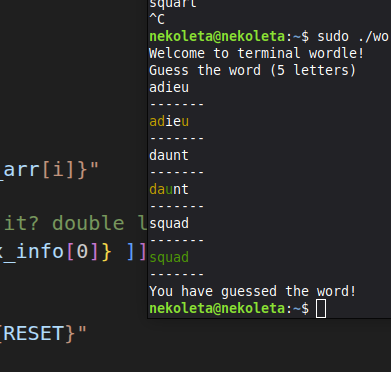
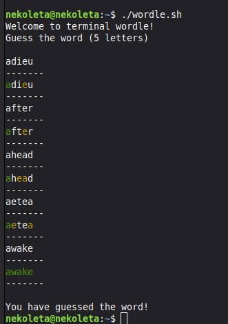

# Terminal Wordle

A bash script that allows you to play Wordle in the terminal, without an interface. 

This script pulls the corresponding word every day, using the NYT API.

This is a silly weekend project :)
