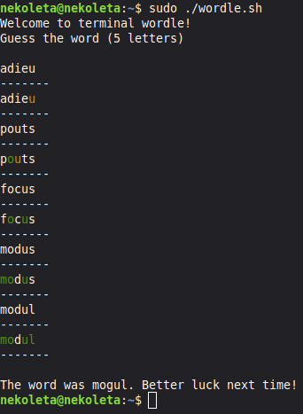

# Terminal Wordle

### Edit: Added word validation

A bash script that allows you to play Wordle in the terminal, without an interface. 

This script pulls the corresponding word every day, using the NYT API.

This is a silly weekend project :)

## How to run:

Make sure to have both wordle.sh, and valid-words.txt, as the list is used to validate input.

If you wish to remove word validation, you can comment `validate_word()` out.
